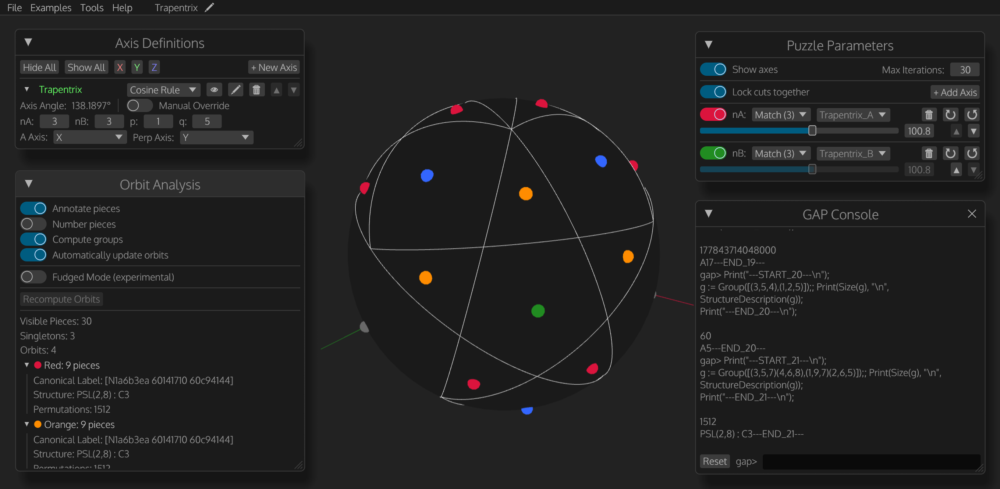

# puzzle-explorer

A web application for twisty puzzle design and geometry analysis. 
https://puzzle-explorer.chandler.io

## Key Features
- Doctrinaire cut visualization for variable axis angles, cut depths, and symmetries
- An in-browser [GAP](https://www.gap-system.org/) console for performing group calculations
- Piece orbit analysis and automatic group labeling
- Import and export puzzle definitions
- Fudged geometry analysis (experimental)

Under active development with lots more features planned - contributions are welcome!

## Project Structure

| Crate | Description | License |
|---|---|---|
| **`puzzle-explorer`** (root) | Web application for puzzle design and geometry analysis | [GPL-3.0-only](LICENSE) |
| [**`puzzle-explorer-math`**](puzzle-explorer-math/README.md) | Standalone math utilities (geometry, symmetry, etc.) | [MIT](puzzle-explorer-math/LICENSE-MIT) OR [Apache-2.0](puzzle-explorer-math/LICENSE-APACHE) |

## License

The main `puzzle-explorer` crate is licensed under the [GNU General Public License v3.0](LICENSE).

The `puzzle-explorer-math` crate is licensed under either [MIT](puzzle-explorer-math/LICENSE-MIT) or [Apache-2.0](puzzle-explorer-math/LICENSE-APACHE), at your option.

## Third-Party Integrations

### Nauty and Traces
Nauty and Traces are used via a WASM port of the Dreadnaut CLI. These algorithms are used to canonize orbit generators, which is useful for caching purposes and for checking the uniqueness of piece types.
- Homepage: https://pallini.di.uniroma1.it/
- WASM port: https://github.com/cjgriscom/dreadnaut-wasm
- Included build: 2_9_3, commit 0dc23ca

### GAP
Puzzle Explorer uses GAP to assign group labels to piece orbits.
- Homepage: https://www.gap-system.org/
- WASM port: https://github.com/wangyenshu/gap-wasm
- Included build: 4.16 (dev), commit 86d58ae
